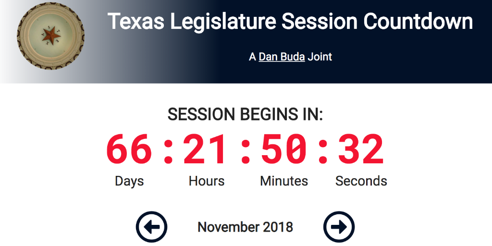

<kbd></kbd>

# Texas Legislature Session Countdown Clock and Calendar

This project was done for several professional and personal reasons. Professionally, as a staffer in the Texas Legislature, I wanted to have a quick reference to all of the deadlines during a legislative session, as well as a reminder of when session is about to rear its ugly head and how much time before it's all over.

Personally, this was a great project to practice using design tools such as use of white space, flexbox and CSS grid, CSS transitions and gradients. It also gave me a chance to (quite heavily) use the [date-fns](https://date-fns.org) library to help with all of the date-time calculations needed to make this all work.

### Built With

- Custom Gulp framework of my own making
- `date-fns` JavaScript library for date & time calculations
- Sass (SCSS)
- Vanilla JavaScript
- Custom JavaScript workaround for issues with `:hover` on mobile devices
